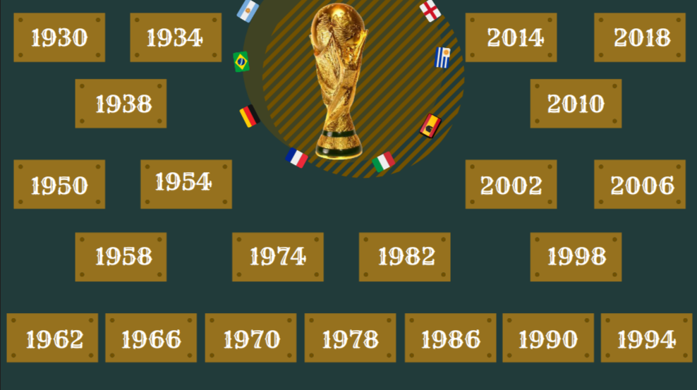
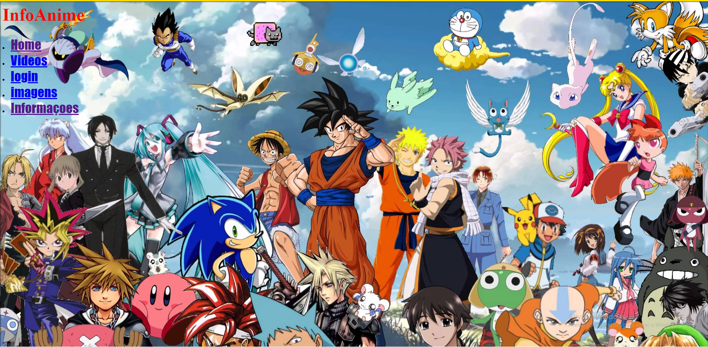
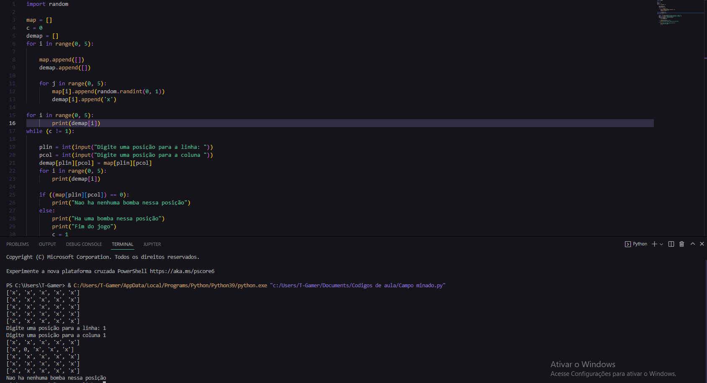
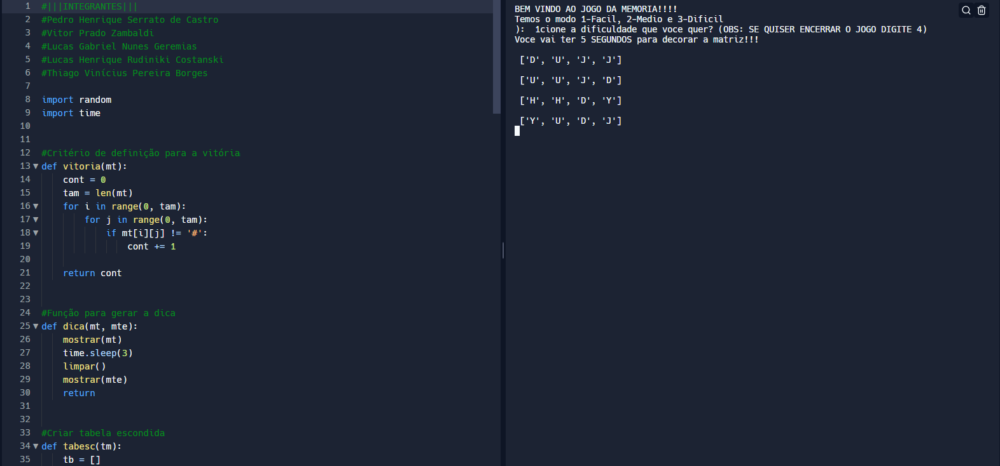
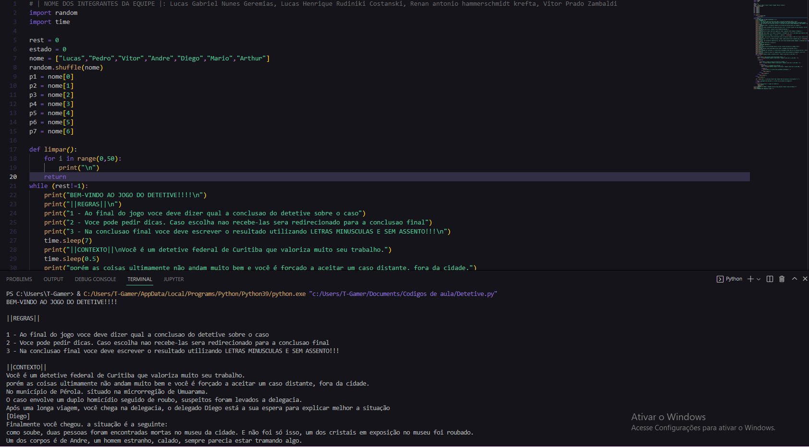

# Sobre Mim

 

Meu nome é Lucas Gabriel, Tenho 18 anos, Sou aluno do 1º periodo do Curso de Ciencia da Computação. Sou formado em Programação de Jogos Digitais pelo SENAI. E busco sempre aprender na area do Desenvolvimento.

## Meus Projetos
Ao longo do periodo fui desenvolvendo alguns trabalhos que me marcaram e que eu acho importante mostra-los aqui

## Experiencia Criativa

 

**Second Nature** é um jogo que foi desenvolvido por mim e minha equipe no **Construct**, ele é de plataforma e o enredo conta basicamente com o personagem principal, Que tem que fazer alguns puzzles para passar de fase e concluir o jogo, no desenvolvimento dele aprendi a **Lidar com eventos e trabalhar a Logica** por cima deles.

 

**Aplicativo Multimidia - Copa Do Mundo** é um aplicativo com o intuito **Educacional/Cultural** em que o usuário pode ver informações sobre as Copas do Mundo, bem como seus melhores gols, campeões, etc. No desenvolvimento desse projeto eu aprendi a trabalhar com **Multiplas bibliotecas e Multimidias**.

 

**InfoAnime** É um Aplicativo WEB desenvolvido por minha equipe, Com o intuito **Informativo/Cultural** em que apresenta **informações sobre os Animes** como: Aberturas, Imagens e top mais assistidos, Alem da possibilidade de **Criar um cadastro pessoal**. Com o Desenvolvimento desse projeto aprendi alguns conhecimentos com **Front End**, **PHP** e **Banco de Dados**.

## Raciocinio Algorítmico

 

**Campo Minado** é um programa feito em linguagem **Python** baseado no jogo do campo minado em que ele pede uma posição ao usuario, E se nessa posição tiver uma bomba ele perde o jogo e se não tiver ele continua. No desenvolvimento desse codigo aprendi a lidar bem com a *Logica por traz de Arrays bem como **Seu comportamento**.

 

**Jogo da Memoria** Tambem feito em linguagem **Python**, baseado num jogo da memoria, em que o usuário deve acertar todos os pares de caracteres iguais para vencer o Jogo. Com o desenvolvimento desse TDE eu aprendi a **Criar Funções** para facilitar o desenvolvimento bem como **Utilizar Bibliotecas Externas** para melhorar a intuitividade do usuário.

## Raciocinio Lógico Matemático

 

**Detetive** feito em *Python*, nos tinhamos que fazer com que o usuário fosse desvendando as hipoteses com **Deducoes logicas** e **Regras de inferencia**, para chegar em uma conclusão final. Neste TDE eu aprendi como **Usar Deduções Logicas** com a **Criação de Algoritmos**
